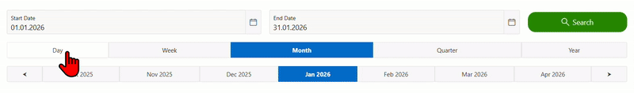

# 🗓️ oracle-apex-smart-timeframe

Smart timeframe & date range engine for **Oracle APEX**.  
Provides a clean, reusable, and fully server-side solution for handling **Day, ISO Week, Month, Quarter, and Year** filters with navigation and intelligent auto-detection for custom date ranges.

---

## 📸 Preview

> Example showing timeframe switching, navigation arrows, and automatic detection when using a custom date range.

---

## ✨ Features

- ✅ Day, ISO Week, Month, Quarter, Year support
- ✅ ISO-compliant week handling (Mon–Sun)
- ✅ Navigation support (previous / next)
- ✅ Smart auto-detection for custom date ranges
- ✅ One central PL/SQL package (single source of truth)
- ✅ Zero JavaScript
- ✅ Clean separation of UI and logic
- ✅ Fully reusable across APEX applications

---

## 🧠 Concept

This solution follows a **strict responsibility split**:

- **View** → provides selectable timeframe options (UI only)
- **Rendering Process** → initializes the default state
- **Submit Process** → delegates all logic
- **PL/SQL Package** → contains the complete business logic

All calculations are handled **server-side** in a single reusable procedure.

---

## 📦 Repository Contents

All files are located in the **root directory** for easy copy & paste usage:

- `README.md`  
  Project documentation and setup guide

- `apex_timeframe_package.sql`  
  Central PL/SQL package containing all timeframe logic

- `apex_timeframe_view.sql`  
  View used as LOV source for timeframe detail navigation

- `apex_page_rendering_process.sql`  
  Rendering process (Before Header) for initial state setup

- `apex_page_submit_process.sql`  
  Submit process (After Submit) that calls the package

---

## ⚙️ Requirements

### Oracle APEX
- Oracle APEX 21.x or higher (lower versions may also work)
- No JavaScript required

### Required Page Items

The following page items **must exist with exactly these names**:

- `P1410_START_DATE`  
  Date Picker (DD.MM.YYYY)

- `P1410_END_DATE`  
  Date Picker (DD.MM.YYYY)

- `P1410_TIMEFRAME`  
  Radio Group  
  Values: `D`, `W`, `M`, `Q`, `Y`

- `P1410_TIMEFRAME_DETAIL`  
  Radio Group  
  LOV Source: `apex_timeframe_view.sql`

Optional (for predefined start options):

- `P1410_FILTER_START_OPTION`  
  Hidden or Select List  
  Example value: `START_CURRENT_MONTH`

---

## 🛠️ Installation Guide

### 1️⃣ Install the Package

Run the following file in your database schema:

- `apex_timeframe_package.sql`

---

### 2️⃣ Create the Timeframe Detail View

Run:

- `apex_timeframe_view.sql`

This view is used as the **List of Values** for `P1410_TIMEFRAME_DETAIL`.

---

### 3️⃣ Configure the Rendering Process

Create a **Before Header** process on your page.

- Type: Execute Code
- Language: PL/SQL
- Source file:  
  `apex_page_rendering_process.sql`

Purpose:
- Initializes default date range
- Handles predefined start options (e.g. current month)

---

### 4️⃣ Configure the Submit Process

Create an **After Submit** process.

- Type: Execute Code
- Language: PL/SQL
- Name: `Get Date Range`
- Source file:  
  `apex_page_submit_process.sql`

This process:
- Handles timeframe clicks
- Handles navigation arrows
- Handles custom search requests
- Updates start date, end date, timeframe, and detail

---

### 5️⃣ Custom Search Button

Create a button (e.g. **Search**) with:

- Action: Submit Page
- Request: `CUSTOM_SEARCH`

When triggered, the engine will:
- Analyze the entered date range
- Automatically select the most appropriate timeframe
- Update timeframe and detail accordingly

---

## 🔍 Auto-Detection Logic (Custom Date Range)

When using **CUSTOM_SEARCH**, the engine detects:

- **Single day** → Day
- **Exact ISO week** → Week
- **Exact full month** → Month
- **Exact quarter** → Quarter
- **Exact year** → Year
- **Anything else** → Best matching timeframe

This ensures the UI always reflects the selected date range logically.

---

## 💡 Typical Use Cases

- KPI dashboards
- Reports and Interactive Reports
- Analytics pages
- Invoices and billing periods
- Monitoring and statistics
- Any APEX page requiring consistent date filtering

---

## 🧩 Design Principles

- Single entry point
- No duplicated logic
- No page-level calculations
- Clear API
- Predictable behavior
- Easy to extend

---

## 📄 License

MIT License  
Free to use, modify, and distribute.

---

## 🤝 Contribution

Contributions, improvements, and ideas are welcome.  
Feel free to open an issue or submit a pull request.

---

## ⭐ Final Notes

This project was designed to be:
- Simple to integrate
- Easy to understand
- Production-ready
- Reusable across projects

If you use Oracle APEX seriously, this component will save you time.
